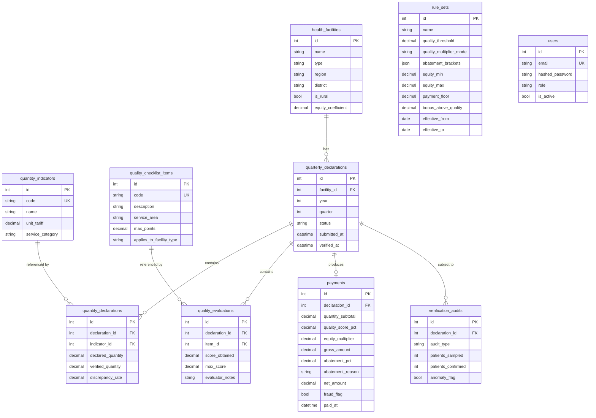
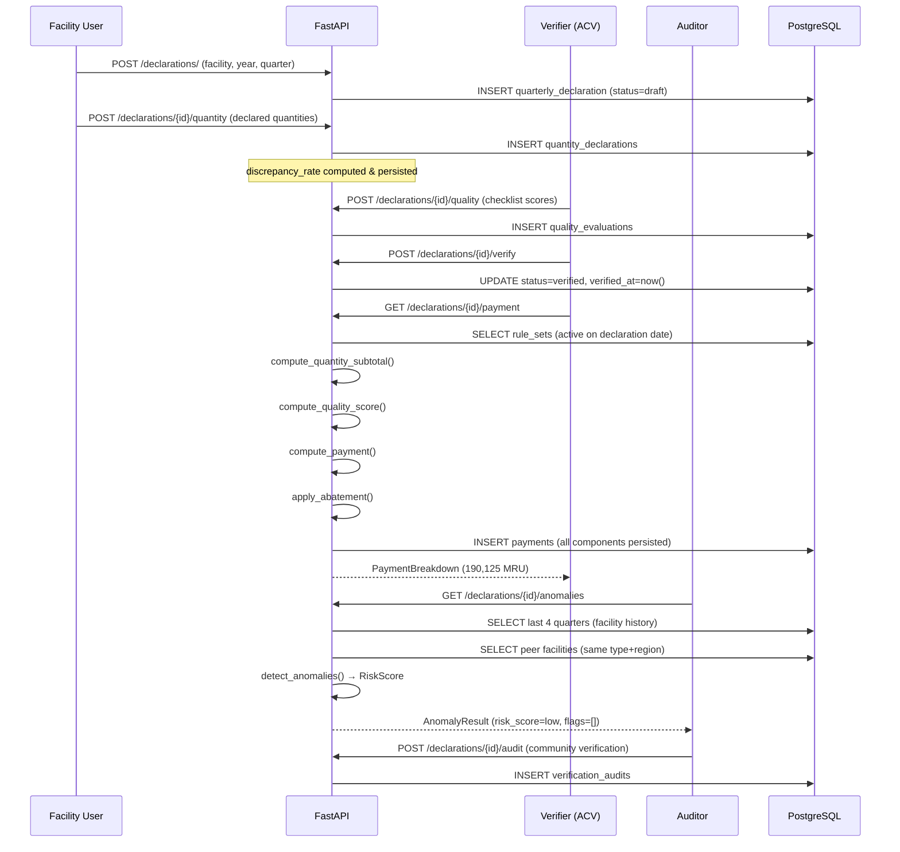

# Architecture

## Component Diagram

```
┌─────────────────────────────────────────────────────────────┐
│                        FastAPI App                           │
│  ┌──────────────┐  ┌──────────────┐  ┌───────────────────┐ │
│  │ /auth        │  │ /facilities  │  │ /declarations     │ │
│  │ /import      │  │ /reports     │  │ /anomalies        │ │
│  └──────┬───────┘  └──────┬───────┘  └────────┬──────────┘ │
│         │                 │                    │             │
│  ┌──────▼─────────────────▼────────────────────▼──────────┐ │
│  │                   Service Layer                          │ │
│  │  facility_service  declaration_service  payment_service │ │
│  │  anomaly_service   report_service                       │ │
│  └──────┬─────────────────────────────────────┬───────────┘ │
│         │                                     │             │
│  ┌──────▼──────────┐               ┌──────────▼──────────┐ │
│  │  Engine Layer    │               │   Database Layer     │ │
│  │  (pure Python,   │               │   (SQLAlchemy 2.0)   │ │
│  │   no ORM)        │               │   AsyncSession       │ │
│  │                  │               │                      │ │
│  │ calculations.py  │               │   health_facilities  │ │
│  │ anomaly.py       │               │   quarterly_decl.    │ │
│  │ rule_engine.py   │               │   payments           │ │
│  └──────────────────┘               │   rule_sets          │ │
│                                     └──────────┬───────────┘ │
└───────────────────────────────────────────────┼─────────────┘
                                                │
                                         PostgreSQL 15
```

## ER Diagram



## Quarterly Cycle Sequence Diagram



## Key Design Decisions

### 1. Engine Isolation
`app/engine/` has **zero imports from `app/models/`**. It operates on plain Python dataclasses (`QuantityLine`, `QualityLine`). This makes the engine:
- Testable without a database
- Reusable as a standalone library
- Safe from ORM coupling

### 2. Decimal Arithmetic
All monetary values use `decimal.Decimal` with `Context(prec=10, rounding=ROUND_HALF_UP)`. PostgreSQL columns use `Numeric(14,2)`. Float is never used in financial computation.

### 3. Persisted Computations
`discrepancy_rate`, all payment components, and quality scores are **persisted at compute time**. The API never recomputes a displayed payment. This satisfies the PBF audit trail requirement.

### 4. RuleSet Versioning
The `rule_sets` table stores `effective_from`/`effective_to` dates. Historical recomputations automatically use the rules that were active at declaration time. This supports multi-year programme management.

### 5. Service Layer
`Routers → Services → Engine/DB`. Routers are thin HTTP adapters (≤ 20 lines each). Services contain orchestration logic. The engine is pure math.
